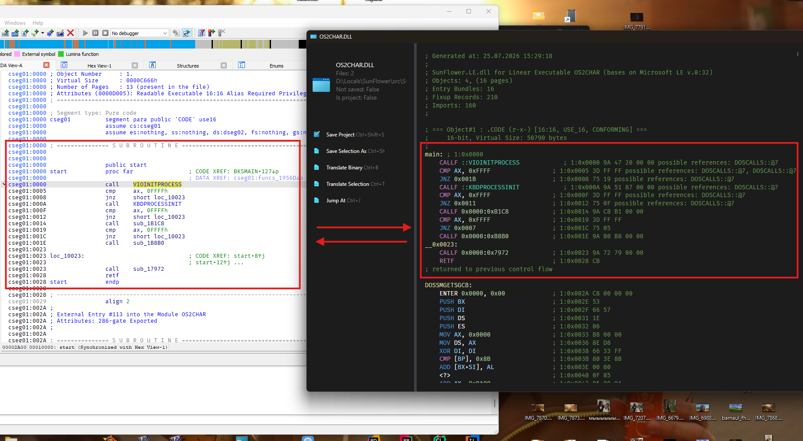

# Linear Executable: supported headers and data structures


LE combined format has 16-bit and 32-bit code/data objects
and some details in format are not compatible with 
IBM OS/2 module format (i.e. LX format) 

| Structure                | Status |
|--------------------------|--------|
| `LE_HEADER`              | [x]    |
| Importing modules table  | [x]    |
| Importing procedures     | [x]    |
| Object table             | [x]    |
| Object Page Table        | [x]    |
| Entry Table              | [x]    |
| Resident Name  Table     | [x]    |
| Non-resident Name  Table | [x]    |
| Module Format Directives | [x]    |
| Fixup Pages              | [x]    |
| Fixup Records            | [x]    |
| Preload Pages            | []     |
| Iterated Data Pages      | []     |
| Demand load Pages        | []     |
| Debug Information        | []     |
| Resource Table           | []     |

Hard and non-linear data structures are `EntryTable` and `FixupRecordsTable` but they are extremely needed
to resolve import and export information from file. All relocations and computed addresses are hint
for understanding how current program/driver may work.

The `LeDisassemblerSeed` and `LxDisassemblerSeed` classes 
present a FlowerSeed API to disassemble program image 
using LE/LX format specifications.

| Plugin Specific              | Status        |
|------------------------------|---------------|
| 386 Instruction Set          | Done          |
| Near procedures control flow | Done          |
| Near labels control flow     | Done          |
| Far Jumps                    | Not supported | 
| Far procedures control flow  | Not Supported |
| Data objects                 | Not Supported |
| Applying of Fixups           | Done          |
| Resolving Runtime Imports    | Done          |
| Resolving Exports            | Done          |



### Mixed code in Objects and Module (or Memory) Pages

Depending on the Object flags bitmask an object might contain
32-bit or 16-bit code. 16-bit code will be executed in the V86 mode.

As the `LNK386.EXE` generates program text depending on the 386+ instruction set,
the default operand size is standing for 32-bit. Instructions with the `0x66` 
prefix will be changed their size, as the fact of x86 `0x66` instruction prefix tells that operand size will be changed.

The instruction in the 32-bit code object changes operand size `32 -> 16`-bit.
For else in the 16-bit code object, instruction operands are 16-bit already and
existence of `0x66` byte prefix change `16 -> 32`-bit operand size.

This idea uses in this .NET library to deconstruct Linear Executables.

Read [my docs](https://github.com/AlexeyTolstopyatov/le-spec) to get more information about.

### VxD Model

`.386` and `.vxd` drivers are different. Files with defined `3.10` or `3.0` version are Windows 3x
virtual drivers. Drivers for Windows 3x don't have resource blocks. Pointer to `VXD_RESOURCE`
returns only `VXD_RESOURCE{}` structure without nested resources. 

Files for Windows VMM (or Windows 95) have nested `VS_VERSION_INFO` resource block
and can be extracted as `.res` file from image.
Virtual device drivers contains resident part of flat header (LE header)
and fields which loader not lookup. 

So, Device Driver has own specific data
which system tries to find and resolve

| Structure                 | Status |
|---------------------------|--------|
| `VXD_HEADER`              | [x]    |
| Driver Resources          | [x]    |
| Driver Description Block  | [x]    |
| Win32 Resource scripts    | []     |

Driver resources structure has many names, in code of sunflower
it calls `VxdResource` like `VxdHeader` see it by `.../plugins/SunFlower.Le/Headers/Le` path

Field `e32_winres_off` names fully like this "Executable Win32 Resources offset"
and this is right for now. This suggestion is right because raw file pointer `e32_winres_off`
points for `.res` file (or compiled resource-script).

```
            | DWORD e32_winres_off |-----+
            | WORD e32_winres_len  |     | This means
            | BYTE e32_ddk_major   |     | not offset from current
            | BYTE e32_ddk_minor   |     | data-structure
            +----------------------+     |
                                         | For real e32_winres_off
VXD_RESOURCES                            | is a raw pointer
+---------------------+ <----------------+
| BYTE r_type         |
| WORD r_id`          |
| BYTE r_name         |
| WORD r_ordinal      |
| WORD r_flags        |
| WORD r_res_length   |
|+-------------------+| 
|| VS_VERSION_INFO   || <-- Win32 Resources starts here
|| and nested rsrc   ||     and it seems like nested types
|| blocks            ||     in this data-struct
|+-------------------+|
+---------------------+ <-- EOF

Usually after this  (when `VS_VERSION_INFO`) ends
stays EOF (or simply driver's image ends)
```

I also suppose, main data what system expects is a Device Declaration block
or `DDB`.

```java
public class DescriptionBlock {
    public int Next;             /* VMM RESERVED FIELD */
    public short SDK_Version;    /* INIT <DDK_VERSION> RESERVED FIELD */
    public short Device_Number;  /* INIT <Undefined_Device_Id> */
    public byte Major_Version;   /* INIT <0> Major device number */
    public byte Minor_Version;   /* INIT <0> Minor device number */
    public short Flags;          /* INIT <0> for init calls complete */
    public byte[] Name;          /* INIT <"        "> Device name */
    public int Init_Order;       /* INIT <Undefined_Init_Order> */
    public int Control_Proc;     /* Offset of control procedure */
    public int V86_API_Proc;     /* INIT <0> Offset of API procedure */
    public int PM_API_Proc;      /* INIT <0> Offset of API procedure */
    public int V86_API_CSIP;     /* INIT <0> CS:IP of API entry point */
    public int PM_API_CSIP;      /* INIT <0> CS:IP of API entry point */
    public int Reference_Data;   /* Reference data from real mode */
    public int Service_Table;    /* INIT <0> Pointer to service table */
    public int Service_Size;     /* INIT <0> Number of services */
    public int Win32_Table;      /* INIT <0> Pointer to Win32 services */
    public int Prev;             /* INIT <'Prev'> Ptr to prev 4.0 DDB */
    public int Reserved0;        /* INIT <0> Reserved */
    public int Reserved1;        /* INIT <'Rsv1'> Reserved */
    public int Reserved2;        /* INIT <'Rsv2'> Reserved */
    public int Reserved3;        /* INIT <'Rsv3'> Reserved */
}
```

And location of it holds in EntryPoints table.
One of not-resident names always names with `_DDB` postfix
and ordinal or this non-resident name is a position
of record (entry point) in entry points bundles (or just in EntryPoints table)

```
            | <resident_record>_DDB | @1 | 0xABCD |
            +-----------------------+----+--------+
                                      |
                                      | Find record #1 in EntryTable
                                      | If non/resident record has
                                      | "_DDB" postfix + not empty VXD_RESOURCE 
Entry Bundle #1 (32-bit)              | 
+----+-----------+---------+ <--------+
| @1 | 0xOFFSET  | 0xFLAGS |-----+
|....| ...       | ...     |     | Offset till this struct
                                 | defines by EntryPoints table
                                 | (see EntryTable in docs)
        +------------------+ <---+
        | DWORD DDB_next   | Instead of Driver.386::entry() 
        | WORD DDB_sdk_ver | it has following #[C, pack(1)] structure 
        | ...              | and next pointers to INIT/PAGE segments
        +------------------+
    Sometimes entry-points not just I286+
    instructions. They can be a unsafe structs
    or just pointers to something in segment.
```

# License 

MIT